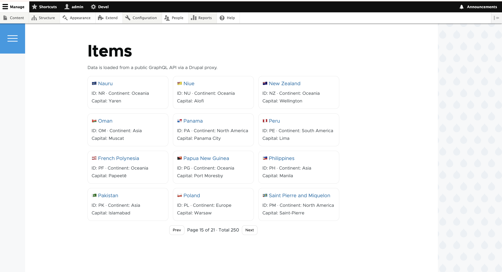
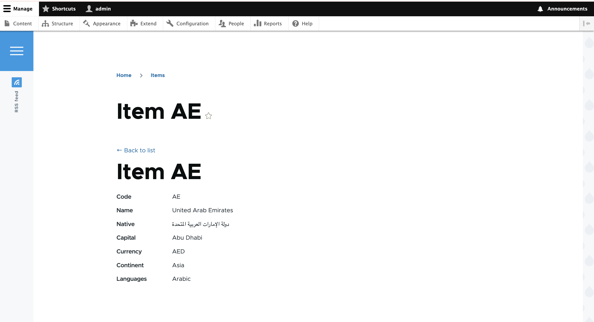

# External Items – Frontend Developer POC – Drupal + GraphQL Integration

## Screenshots




## Overview

This project demonstrates a Drupal 10+ integration with a public GraphQL API.

The UI displays:
- A paginated list view (`/items`)
- A detail view (`/items/{id}`)

For this POC, I used the public Countries GraphQL API:
https://countries.trevorblades.com/

This API was chosen because it provides:
- List and single-item queries
- Nested fields (continent, languages)
- A clean and stable schema

---

## Setup

```bash
ddev start
ddev composer install
ddev drush si -y
ddev drush en external_items -y
ddev drush cr
```

## Usage

After enabling the module, visit:

/items

The detail page is available at:

/items/{id}
